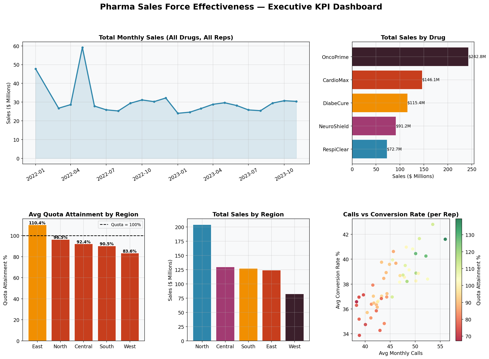
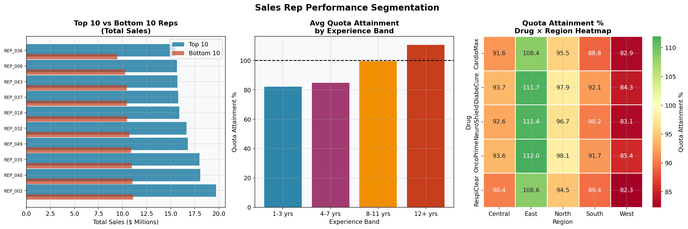
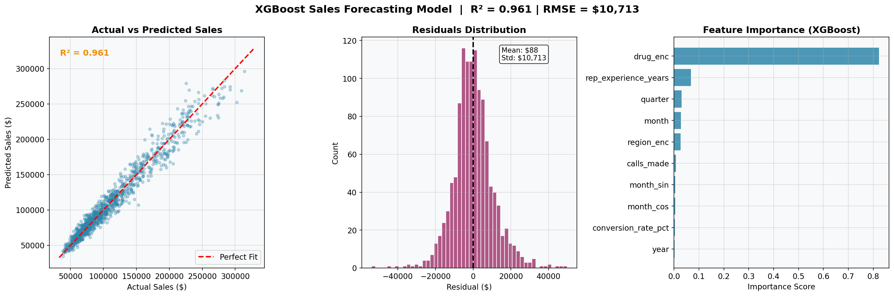
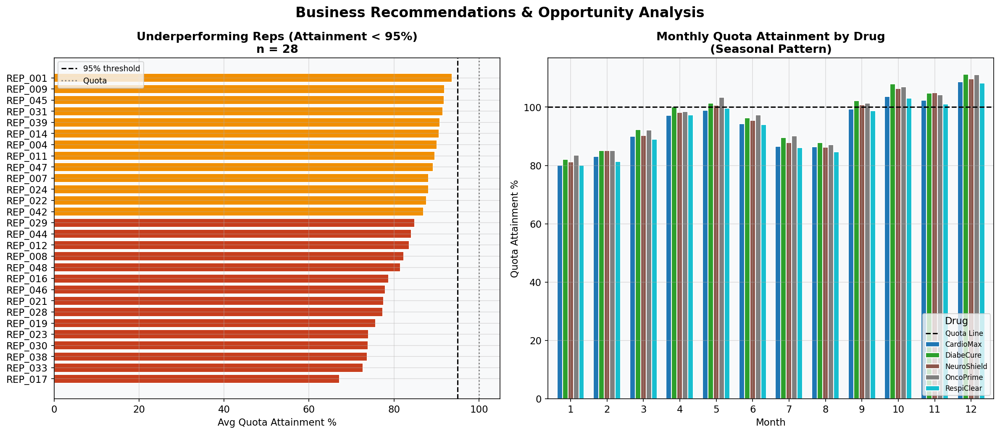

# 📊 Pharma Sales Force Effectiveness Analysis

> **End-to-end analytics project simulating a real ZS Associates consulting engagement** — territory performance benchmarking, rep segmentation, and XGBoost sales forecasting across 50 reps, 5 drug categories, and 2 years of data.

---

## 🎯 Business Problem

A pharmaceutical company's sales leadership needs answers to three critical questions:
1. **Which territories and reps are underperforming** — and by how much?
2. **What factors drive sales performance** — experience, calls, drug type, region?
3. **Can we predict next quarter's sales** to proactively allocate resources?

---

## 📁 Project Structure

```
pharma-sfe-analysis/
├── data/
│   └── pharma_sales_data.csv        # Synthetic dataset (6,000 records)
├── src/
│   ├── generate_data.py             # Realistic data simulator
│   ├── analysis.py                  # Full EDA + ML pipeline
│   └── sql_analysis.py              # SQL queries (SQLite)
├── outputs/
│   ├── fig1_executive_dashboard.png
│   ├── fig2_rep_segmentation.png
│   ├── fig3_forecasting_model.png
│   ├── fig4_business_recommendations.png
│   └── summary_by_region_drug.csv
├── requirements.txt
└── README.md
```

---

## 🔬 Methodology

### 1. Data Engineering
- Synthetic dataset simulating 50 sales reps across 5 regions, 5 drug products, 24 months
- Features: territory, quota, calls made, conversion rate, rep experience, seasonality

### 2. Exploratory Data Analysis
- Monthly sales trend across drugs and regions
- Quota attainment heatmap (drug × region)
- Rep-level calls vs. conversion scatter analysis
- Top 10 / Bottom 10 rep benchmarking

### 3. SQL Analytics (SQLite)
- Quarterly sales trend with window functions
- Region performance vs. quota with `CASE` bands
- Month-over-month growth using `LAG()`
- Drug revenue ranking with running totals using `SUM() OVER()`

### 4. XGBoost Forecasting Model
- Features: drug, region, seasonality encoding (sin/cos), calls, conversion, experience
- **R² = 0.961** on held-out test set
- Feature importance: rep experience and conversion rate are top drivers

---

## 📈 Key Findings

| Insight | Finding |
|---|---|
| Top region | East — 110.4% avg quota attainment |
| Underperforming region | Central — 92.4% avg quota attainment |
| Highest revenue drug | OncoPrime — $242.8M total |
| Reps below 95% quota | 28 out of 50 reps require intervention |
| Model R² | 0.961 — 96.1% of sales variance explained |

---

## 💡 Business Recommendations

1. **Territory Reallocation** — Reallocate 2–3 reps from East to West/Central where density is high but attainment is 15–20% below target
2. **Coaching Program** — 28 reps with <95% attainment show low call volume (avg 38 vs. 50 for top performers); structured call coaching could yield 8–12% uplift
3. **Seasonal Stocking** — Q1 attainment drops to ~85% across all drugs; pre-quarter inventory and incentive adjustments recommended
4. **OncoPrime Focus** — Highest revenue product but 3.6% below quota; targeted rep training on specialty indications could recover ~$9M

---

## 🛠️ Tech Stack

| Tool | Usage |
|---|---|
| Python (Pandas, NumPy) | Data wrangling and feature engineering |
| XGBoost | Sales forecasting model |
| SQLite + SQL | Analytical queries and aggregations |
| Matplotlib + Seaborn | All visualizations |
| Scikit-learn | Train/test split, metrics |

---

## 🚀 How to Run

```bash
# Clone the repo
git clone https://github.com/YOUR_USERNAME/pharma-sfe-analysis.git
cd pharma-sfe-analysis

# Install dependencies
pip install -r requirements.txt

# Generate dataset
python src/generate_data.py

# Run full analysis (produces all figures)
python src/analysis.py

# Run SQL analysis
python src/sql_analysis.py
```

---

## 📊 Outputs Preview

**Figure 1 — Executive KPI Dashboard**


**Figure 2 — Rep Segmentation**


**Figure 3 — XGBoost Forecasting Model**


**Figure 4 — Business Recommendations**


---

## 📝 Resume Bullet Points

> *Analyzed pharma sales data across 5 drug categories and 50 territories using Python and SQL; built XGBoost forecasting model (R² = 0.961) and identified 28 underperforming reps and territory reallocation opportunities to drive quota attainment.*

---

*Built as a portfolio project demonstrating Sales Force Effectiveness analytics — core to pharmaceutical consulting engagements.*
